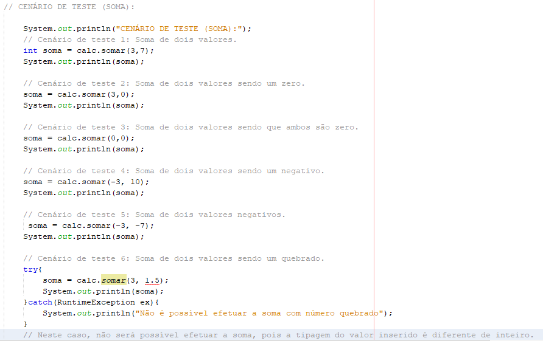
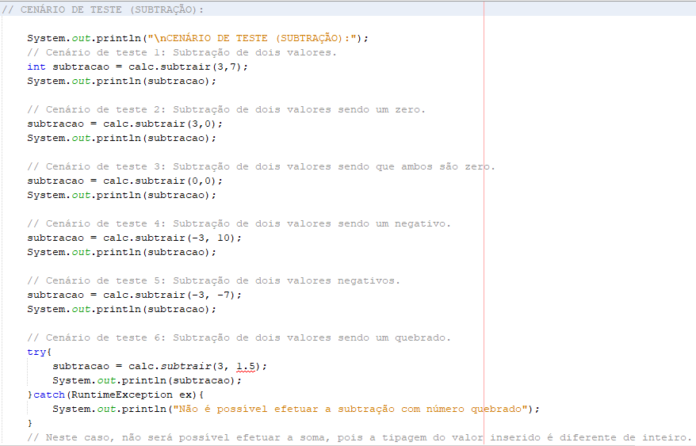
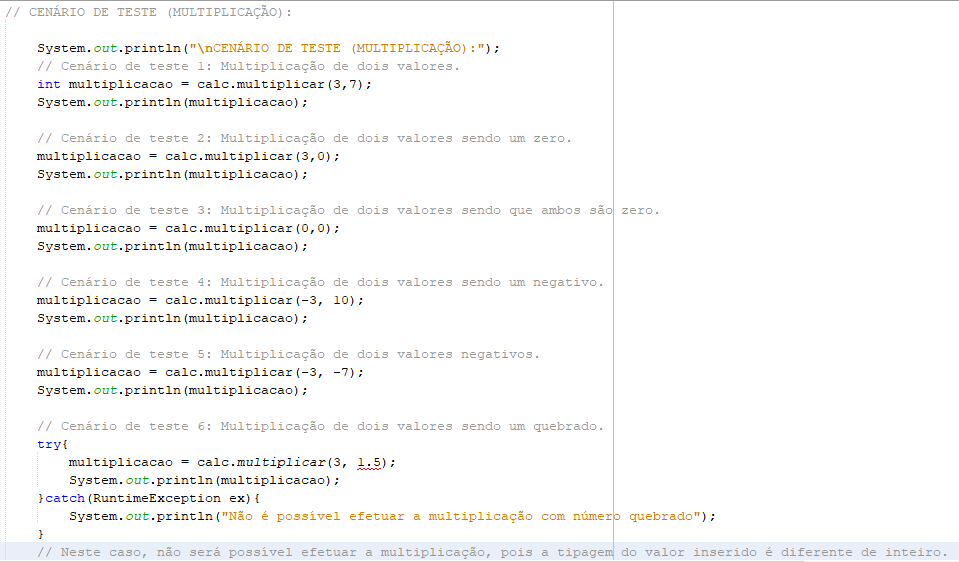
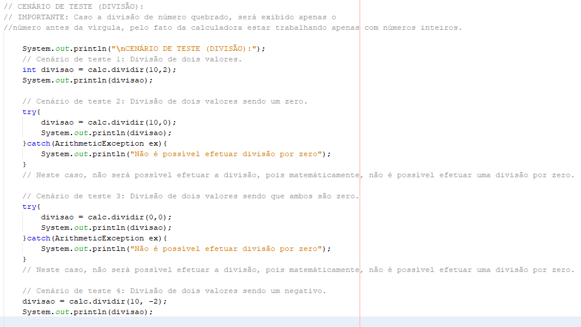
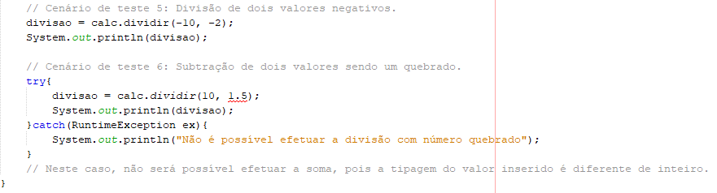

# Atividade Qualidade e Testes de Software - Testes Automatizados (Calculadora)

## Descrição
A atividade consiste basicamente em desenvolver uma calculadora com as operações matemáticas básicas e executar diversos testes automatizados para verificar a eficácia e detectar possíveis erros no funcionamento da calculadora.

## Mecânicas
Foram criadas duas classes distintas, uma classe onde abriga os métodos com as operações básicas, dando funcionamento a calculadora, e outra classe de teste onde será efetuado diversos cenários diferentes, que testarão a eficácia da calculadora.

## Classe (Calculadora)
Linhas de código da classe calculadora:

## Classe de Testes (Calculadora)
### Cenário de teste para o método de soma:

### Cenário de teste para o método de subtração:

### Cenário de teste para o método de multiplicação:

### Cenário de teste para o método de divisão:

#### Parte 1

#### Parte 2
